CMS管理ページ
=========================================

.. todo:: ログイン処理からワークフローを書く。

.. todo:: CMS側でのログイン方法についてまとめる。

CMS管理側の画面レイアウト。サイト構成は以下の通り

.. blockdiag::

   diagram{
   orientation = portrait;

   group{
     color = "pink";
     label = "CMS認証部分";
	 CMSログインページ -> バックエンドログインページ[style="dotted", label="oauth"];
	 バックエンドログインページ -> トップページ[style="dotted",label="oauth"];
   }

   トップページ -> イベント検索;
   トップページ -> "(イベント新規登録)";
   トップページ -> アセットリスト;
   トップページ -> ユーザアカウント管理;

   group {
     color = "lightgreen";
	 label = "イベント検索ページ";
	 イベント検索 -> 検索結果一覧 [style="dotted",label="検索"];
   }

   検索結果一覧 -> イベント詳細;
   
   group{
     label = "イベント詳細ページ";
	 イベント詳細 -> ページ新規登録[style="dotted"];
	 イベント詳細 -> ページ詳細[style="dotted"];
	 イベント詳細 -> アセット管理[style="dotted"];
	 イベント詳細 -> トピック管理[style="dotted"];
   }
   }

.. note:: サイトトップはログインユーザのパーミッションによって表示できるメニューが異なる。
.. note:: イベントの新規登録は、バックエンド側からフロントエンドCMSが用意しているAPI経由で行う。(イベント新規登録)は作らないかもしれない。

フロントエンドCMSのワークフローについてのワークフローを示す。

+ イベント詳細ページ作成のワークフロー
+ イベント詳細ページの編集のワークフロー
+ アセット管理のワークフロー
+ アカウント管理のワークフロー

.. _layout_create_page:

イベント詳細ページ作成のワークフロー
--------------------------------------------------------------------------------

.. blockdiag::

   diagram{
   orientation = portrait;

   group{
     color = "pink";
     label = "CMS認証部分";
	 CMSログインページ -> バックエンドログインページ[style="dotted", label="oauth"];
	 バックエンドログインページ -> トップページ[style="dotted",label="oauth"];
   }

   トップページ -> イベント検索;

   group {
     color = "lightgreen";
	 label = "イベント検索ページ";
	 イベント検索 -> 検索結果一覧 [style="dotted",label="検索"];
   }

   検索結果一覧 -> イベント詳細;
   
   group{
     label = "イベント詳細ページ";
	 イベント詳細 -> ページ新規登録[style="dotted"];
   }
   }

イベント詳細ページ作成のワークフローは以下の手順を踏む

0. (バックエンド側で、作成したい詳細ページのイベントが既に生成されているとする)
#. CMSサイトへアクセス、バックエンド側の認証システムで認証を行う。 トップページに画面遷移する
#. トップページで、利用したい管理対象サイトのイベント検索のリンクをクリック。イベント検索ページに遷移する。
#. 検索フォームで検索を行う。検索結果の中から詳細ページを作成したいイベントを選択する。指定したイベントの詳細ページに遷移する。
#. ページ新規登録を選びページ作成ページに行く。
#. ページ作成ページでページを作成する。

.. note:: イベントの登録は、バックエンド側で行う。バックエンドのシステムがフロントエンドCMSのAPIを呼び出し作成するという仕様。そのため、イベント詳細ページを作成する際には既に、対象となるイベントが生成されている。

CMSサイトへアクセス、バックエンド側の認証システムで認証を行う。 トップページに画面遷移
^^^^^^^^^^^^^^^^^^^^^^^^^^^^^^^^^^^^^^^^^^^^^^^^^^^^^^^^^^^^^^^^^^^^^^^^^^^^^^^^^^^^^^^^^^^^^^^^^^^^^^^^^^^^^^^^^^^^^^^^

バックエンドとアカウントを共有するため、バックエンドの認証使う。以下のような画面構成

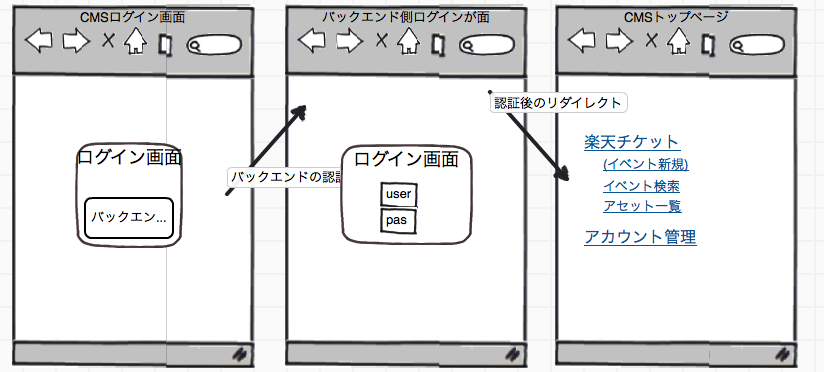

#. CMSのサイトに未ログイン状態でアクセスしようとすると、ログイン画面に飛ぶ。
#. ログイン画面からバックエンドのログイン画面に飛ぶ。
#. バックエンドで認証後、トップページにリダイレクトされる。 

.. note:: アクセスするときにバックエンド側の認証システムを利用して認証を行う。認証後トップページに画面遷移する。
  
トップページ
^^^^^^^^^^^^^^^^^^^^^^^^^^^^^^^^^^^^^^^^

トップページに、CMS管理者が利用可能なメニューが表示される。

.. note:: メニューはオペレータが管理できる権限を持つサイトの数によって変わる。(ただし、現状は楽天チケット１つのみ)
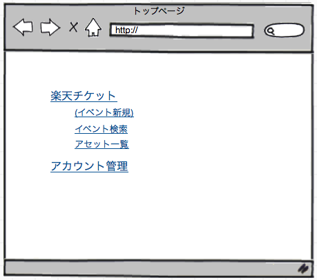

利用できるメニューに以下のものがある。

:(イベント新規): イベントの登録(ただし、イベントの新規登録はバックエンド側で行うのでこのページは作成しない)
:イベント検索: イベント検索(ただし、管理対象となるサイトの管理対象内のファイルのみを検索範囲とする)
:アセット一覧: 管理対象となるサイトで登録したアセット(画像や動画)の一覧が表示できる画面

今回は要旨は、イベント登録の手順を説明することなため、アセット一覧については別途説明する.

.. todo:: ここにアセット一覧の利用方法についてのリンクを貼る

イベント検索をクリックする。

イベント検索(検索結果一覧)
^^^^^^^^^^^^^^^^^^^^^^^^^^^^^^^^^^^^^^^^

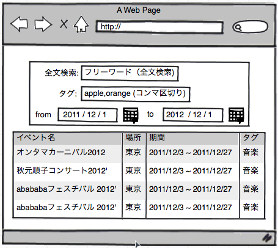

イベント検索を行うここのページでは以下の内容で検索できる。詳細は :ref:`function-search` 参照のこと。

+ イベント名など(全文検索)
+ タグ
+ イベントの開催期間

検索を行った後、検索結果から詳細ページを作成したいイベントを選択する。

.. note:: 全文検索が行える。タグはコンマ区切りでand検索ができるという想定

イベント詳細
^^^^^^^^^^^^^^^^^^^^^^^^^^^^^^^^^^^^^^^^

イベント検索結果のイベント名をクリックすると、対応するイベント詳細ページに飛ぶ。

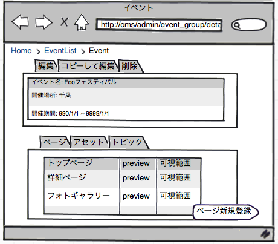

画面下部のページタブに存在するページ新規登録ボタンをクリックする。

ページ新規登録
^^^^^^^^^^^^^^^^^^^^^^^^^^^^^^^^^^^^^^^^

以下がページ新規登録の画面イメージ。

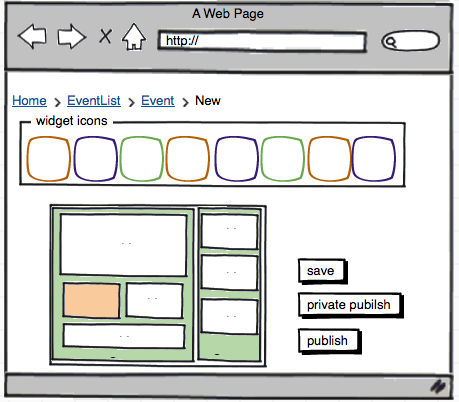

ページの作成には、CMSが提供するウィジェットという機能を利用する。
(ウィジェットについての詳細は、 :ref:`widget` の項を参照)

新規登録は、以下の手順に従って操作を行う。

#. ページのレイアウトを選択する
#. 選んだページレイアウトにウィジェットを配置する。

また、ページ詳細ページについても、既にデータが挿入されているという違いはあるものの。
ページ新規登録のページと同じ表示形式のページを想定している。

イベント詳細ページの編集のワークフロー(イベントページの編集)
--------------------------------------------------------------------------------

.. blockdiag::

   diagram{
   orientation = portrait;

   group{
     label = "イベント詳細ページ";

     ページ新規登録[style="dotted"];
	 イベント詳細 -> ページ新規登録[style="dotted"];
	 イベント詳細 -> ページ詳細[style="dotted"];
     ページ詳細 -> 仮公開;
	 イベント詳細 -> アセット管理[style="dotted"];
	 イベント詳細 -> トピック管理[style="dotted"];
   }
   }

イベント詳細ページの編集のワークフローは以下の通り

#. (イベント詳細ページと同様の手順でイベント詳細ページに進む)
#. ページタブに表示されるページ名をクリック
#. ページ詳細ページで登録内容を編集する

(イベント詳細ページと同様の手順でイベント詳細ページに進む)
^^^^^^^^^^^^^^^^^^^^^^^^^^^^^^^^^^^^^^^^^^^^^^^^^^^^^^^^^^^^^^^^^^^^^^^^^^^^^^^^
:ref:`layout_create_page` と同様ので手順でイベント詳細ページに進む

イベント詳細ページ
^^^^^^^^^^^^^^^^^^^^^^^^^^^^^^^^^^^^^^^^

イベント詳細ページでは、イベントに関する情報が表示されと以下の操作が行える。

+ ページ新規登録
+ ページ一覧表示(ページ詳細画面に遷移し編集)
+ アセット管理(アセット詳細画面に遷移し編集)
+ トピック管理(トピック文章を挿入)

それぞれの操作の画面イメージ。

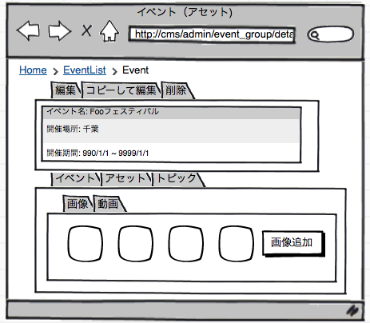
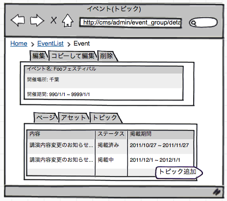

ページタブでページ名をクリックすると対応するページ詳細ページに飛ぶ。
アセットタブでアセットの追加、削除などが行える。
トピックタブでトピックの追加／編集／削除が行える。

ページ詳細ページ
^^^^^^^^^^^^^^^^^^^^^^^^^^^^^^^^^^^^^^^^

ページ詳細ページは、ページ新規登録のページと同様の表示。

ページ詳細ページではデータ編集後、以下の操作を行うことができる

+ publish: 作ったページの公開
+ private publish: 仮公開
+ save: 設定内容を保存

これらの操作を行うと更新内容が反映される。

.. note:: 後々、作るページには公開範囲(可視範囲)が設定できるようにする。ただし、開発の初期スプリントでは、 :ref:`private_publish` の機能を利用し、一時的にユニークなURLでページを公開する。生成されたURLをクライアントにメールなどで送付しページ内容の確認などを依頼することになる。

仮公開
^^^^^^^^^^^^^^^^^^^^^^^^^^^^^^^^^^^^^^^^

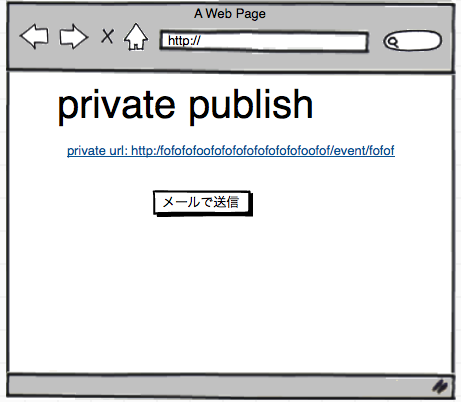

.. note:: 仮公開機能のUIが未決定。単にurlを表示するだけになる可能性もある。

.. _layout_asset:

トップページから行えるその他の操作
----------------------------------------

+ アセット管理
+ アカウント管理

アカウント管理のワークフロー(過去にアップロードしたアセットのダウンロード)
^^^^^^^^^^^^^^^^^^^^^^^^^^^^^^^^^^^^^^^^^^^^^^^^^^^^^^^^^^^^^^^^^^^^^^^^^^^^^^^^^^^^^^^^^^^^^^^^^^^^^^^^^^^^^^^^^^^^^^^^

(アセット管理にいついての詳細は :ref:`function_asset`)

.. note:: アセットの追加/編集/削除は、各イベント詳細ページのアセットタブで行う。

.. blockdiag::

   diagram{
   orientation = portrait;

   group {
   color = "pink";
   トップページ;
   }
   トップページ -> アセットリスト -> "アセット詳細(downloadページ)";
   トップページ -> ユーザアカウント管理 -> ユーザ詳細;

   }

アップロードした全てのアセットを一覧表示したい場合には、トップページのアセット一覧機能を使う。

アセット一覧
^^^^^^^^^^^^^^^^^^^^^^^^^^^^^^^^^^^^^^^^

アセット一覧ページには、過去にアップロードしたアセットが一覧で表示される。

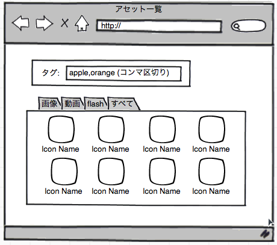

また、ページ上部の検索フォームを用いて、タグ検索することが可能。
複数のタグを用いる場合には、コンマで区切る(OR検索)
表示されたアセットのアイコンをクリックするとアセット詳細ページに飛ぶ。

.. note::

   タグ検索について仕様が煮詰まってない。AND,ORの検索が必要か。その表記法はどうするかが未定。

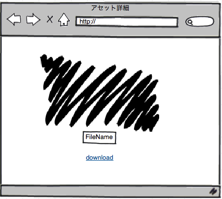

画像がオリジナルのサイズで表示され、ダウンロードのリンクが提供されている。

.. note:: ダウンロードページのUIは未決定。

アセット一覧ページから

アカウント管理
^^^^^^^^^^^^^^^^^^^^^^^^^^^^^^^^^^^^^^^^

.. note:: まだ全然細かいUIは考えていない。

	 + トップページからアカウント管理というリンクが存在する。
	 + アカウント管理のリストページは、自身の権限で閲覧可能なアカウントのみが表示される。(e.g. ASP販売後、他のクライアントのアカウントは見られない。)
     + 変えられるのはpermissionのみ(バックエンドのアカウント設定ページへのリンクがあっても良いかもしれない。)
     + *直接バックエンドへリンクでももしかしたら良いかもしれない。*

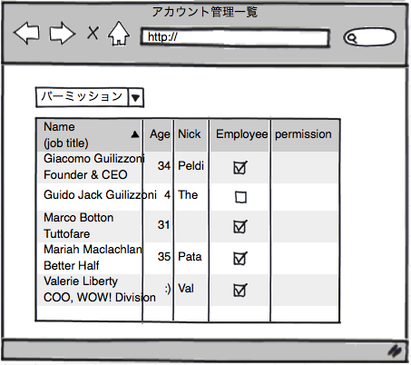

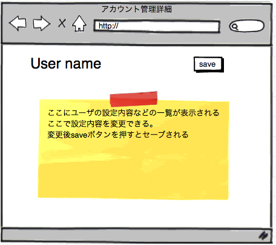

.. todo:: アセット一覧ページ。アセット管理。トピックの追加。ユーザ管理のページレイアウトを書く。

TBD
