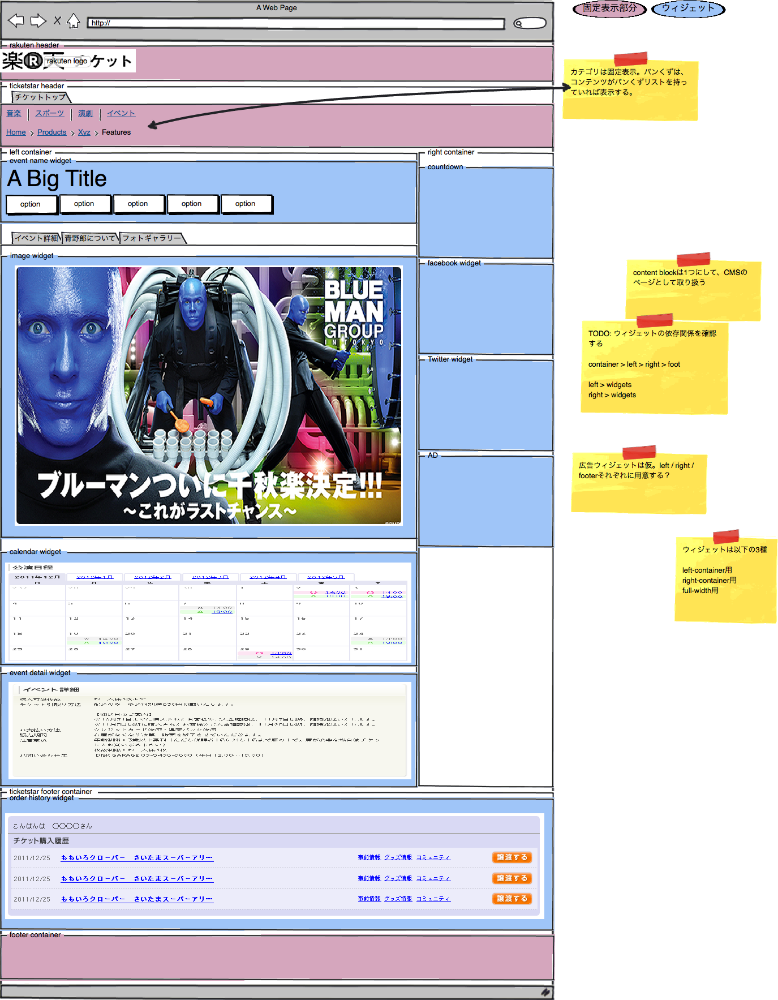

フロントページ
==================================

サイト利用者がPCまたはガラケーのブラウザで表示するページ。

.. blockdiag::

   diag {
	 orientation = portrait;

	 group {
	   label = "CMS administrator scope";

	   チケットトップ;
	   サイトマップ;
	   ヘルプページ;
	   特集ページ;
	   "カテゴリ一覧ページ(大階層)";
	   カテゴリページ;
	   検索結果;
	 }

         group {
           label = "salesforce";

	   お問い合わせフォーム;
	   お問い合わせ確認;
	   お問い合わせ完了;
         }

	 group {
	   label = "CMS client scope";
	   color = "#7777FF";

	   イベント詳細;
	   パフォーマンス／座席選択;
	 }

	 group {
	   label = "backend";
	   color = "#77FF77";

	   購入処理へ;
	 }

	 チケットトップ -> サイトマップ;
	 チケットトップ -> ヘルプページ;
	 チケットトップ -> お問い合わせフォーム -> お問い合わせ確認 -> お問い合わせ完了;
	 チケットトップ -> 特集ページ;
	 チケットトップ -> "カテゴリ一覧ページ(大階層)";
	 "カテゴリ一覧ページ(大階層)"-> 検索結果;
	 チケットトップ -> 検索結果;
	 "カテゴリ一覧ページ(大階層)" -> カテゴリページ;
	 カテゴリページ -> 検索結果;
	 特集ページ -> イベント詳細;
	 カテゴリページ -> イベント詳細;
	 検索結果 -> イベント詳細;

	 イベント詳細 -> パフォーマンス／座席選択;
	 パフォーマンス／座席選択 -> 購入処理へ [style=dotted];
   }

チケットトップ
------------------------

サイトトップページの構成イメージ。

構成要素
^^^^^^^^^^^^^^^^

画面上部から構成要素を一覧する。

* カテゴリ一覧メニュー
* ハイライトイベント？
* トピックス
* 注目のイベント（ハイライト？）
* まもなく開演！
* 検索
* 特集
* ヘルプ
* 予約チケットの確認
* メルマガ購読をする
* プレミアムチケットはこちら
* 広告
* カテゴリ
* キーワード

.. note::
   特集ページなどは任意のページに任意のURLが登録できるだけで良い。
   http://dev.ticketstar.jp/redmine-altair/issues/103

   > 現状静的コンテンツとして作成している物が、基本的に新システムでは公演詳細ページがその機能を担います。それで対応できない場合は現状と同じように静的コンテンツを作成することにより対応しするので、必要ないと思います。

   > ページというよりかは、任意のページを任意のURLに作成できるような仕組みが欲しいというところです。

サイトマップ
------------------------

.. note:: http://dev.ticketstar.jp/redmine-altair/issues/119 検討中

特集ページ
------------------------

通常のページとして管理できそうだが、画像内にリンクが有る点が異なる。

.. note:: http://dev.ticketstar.jp/redmine-altair/issues/147

カテゴリ一覧ページ
------------------------

TBD

.. note:: いる？

カテゴリページ
------------------------

検索結果
------------------------

Solrを使用して検索を行う。

参考:

* `楽天チケットの現行ページ <http://ticket.rakuten.co.jp/s/%E3%82%B9%E3%83%9D%E3%83%BC%E3%83%84?q=%E7%9B%B8%E6%92%B2>`_ では文字列の検索のみっぽい
* :ref:`funciton-search`

構成要素
^^^^^^^^^^^

* パンくず
* ファセット（スポーツ (1)とか）
* 検索結果一覧

 * イベント名
 * 開催期間
 * 場所
 * 販売状態

※右カラムはチケットトップと同じ。

チケット詳細
--------------------------

チケット詳細表示を行うページのレイアウト。各種ウィジェットが多く存在する。

パフォーマンス／座席選択
----------------------------

以下のような画像が入る。

.. image:: ../images/seatfigure.png
   :width: 640px

TBD
