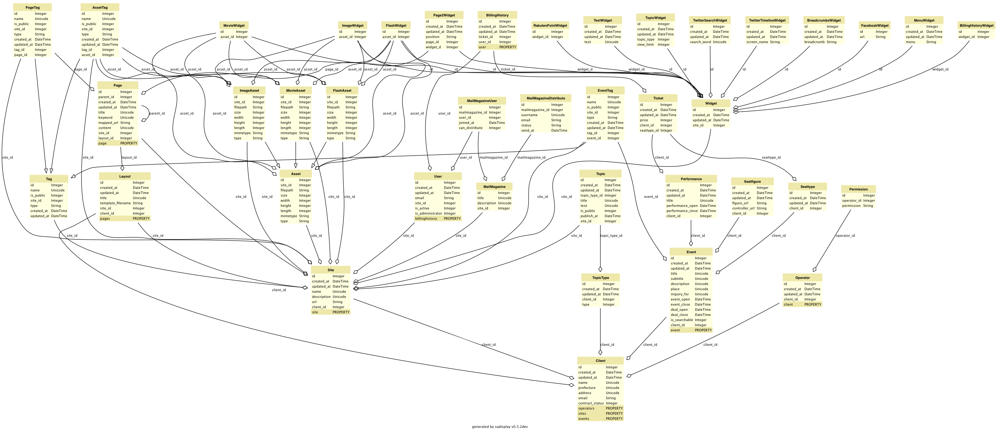

データモデル
=========================

.. blockdiag::

   diag {

     クライアント;
     オペレータ（サイト管理者）;
     権限;
     イベント;
     ページ;
     タグ;
     トピック;

     クライアント <-> オペレータ（サイト管理者）;
     オペレータ（サイト管理者） -> 権限 [dir = none];

     クライアント -> イベント -> パフォーマンス;
     クライアント -> 席図 -> パフォーマンス;
     クライアント -> 券種 -> パフォーマンス;
     クライアント -> ページ;
     クライアント -> アセット;
     クライアント -> ウィジェット;

     クライアント -> レイアウト -> ページ;

     ページ -> 使用ウィジェット [dir = none];
     ページ -> タグ [dir = none];

     アセット -> 画像;
     アセット -> 動画;
     アセット -> Flash;

     クライアント -> ユーザ -> 購入履歴;

     ウィジェット -> トピック;
     ウィジェット -> フリーテキスト;
     ウィジェット -> Facebook;
     ウィジェット -> Twitter;
     ウィジェット -> 広告;

   }

ER
==================

