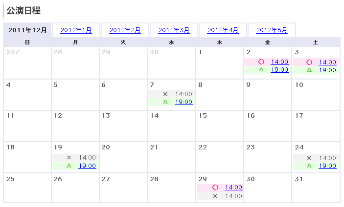

公開カレンダウィジェット
============================

イベントの公開カレンダを表示するウィジェット。

イベントのカレンダ情報はバックエンドより取得し、CMS側で一定時間キャッシュする。
テンプレートへの直接記述またはincludeファイル、あるいはAjaxでの呼び出しを行う想定。

種類
-----------------

カレンダの表示パターンは以下の2種類。

* 開始と終了までの一般的なカレンダ（7d x 4w x nm）
* 月毎にタブ切り替え

データ構造
-----------------

see also: :ref:`object-calendar`
