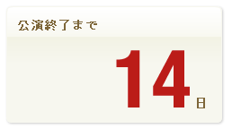

.. _widget-countdown:

n日前カウントダウンウィジェット
================================================

残り日数を表示するウィジェット。

CMS内で管理、生成を行い、テンプレートへの直接記述またはincludeファイルとする。
AjaxまたはIFRAMEでの呼び出し、クライアントサイドJavaScriptで計算、描画を行う方式も検討する。

カウントダウンのバリエーションは以下のとおり。

* 販売終了日時までのカウント
* 販売開始日時までのカウント
* イベント開始日までのカウント
* イベント終了日までのカウント
* 任意の日付までのカウント

http://dev.ticketstar.jp/redmine-altair/issues/91
http://dev.ticketstar.jp/redmine-altair/issues/98

処理シーケンス
----------------------

.. seqdiag::

   seqdiag {
     browser => cms [label = "GET Request"] {
       cms => cache [label = "Check cache" ];
       cms => backend [label = "Fetch event detail"];
       cms => cache [label = "Store event detail"];
     }
   }

バックエンド通信
--------------------

イベントデータの公演開始日、公演終了日を使用する。
データは夜間バッチにより1日1回取得し、最長24時間キャッシュする。

:method: GET
:URL: http://backend-ticketstar/event/{id}

データ構造
----------------------

see also: :ref:`object-event`
