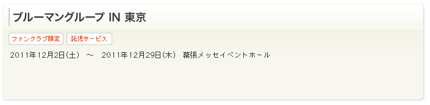

イベント概要ウィジェット
============================

イベント概要を表示するウィジェット。

CMS内で管理、生成を行い、テンプレートへの直接記述またはincludeファイルとする。
イベント詳細オブジェクトの内容を描画する。

表示内容
----------------

* イベント名
* オプション（ファンクラブ限定、託児サービスなど）
* 開催期間
* 会場

.. note:: 表示内容は固定か？それとも変更することが出来るか？
.. note:: 記載内容はフリーテキストではダメか？

データ構造
---------------------

see also: :ref:`object-event`
