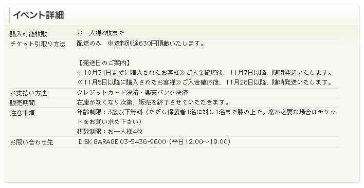

イベント詳細ウィジェット
============================

イベントの詳細情報を表示するウィジェット。

CMS内で管理、生成を行い、テンプレートへの直接記述またはincludeファイルとする。
Ajaxでの呼び出しは行わない想定。イベント詳細オブジェクトの内容を描画する。

表示項目
-----------------

* 制限条件（タイトルフリーワード＋本文フリーワード？）
* チケット引取り方法（フリーワード）
* 支払い方法（CMS管理画面で選択）
* 販売期間（表示パターン選択＋開始日、終了日）
* 注意事項（フリーワード）
* 問い合わせ先（フリーワード）

データ構造
-------------------

see also: :ref:`object-event`
