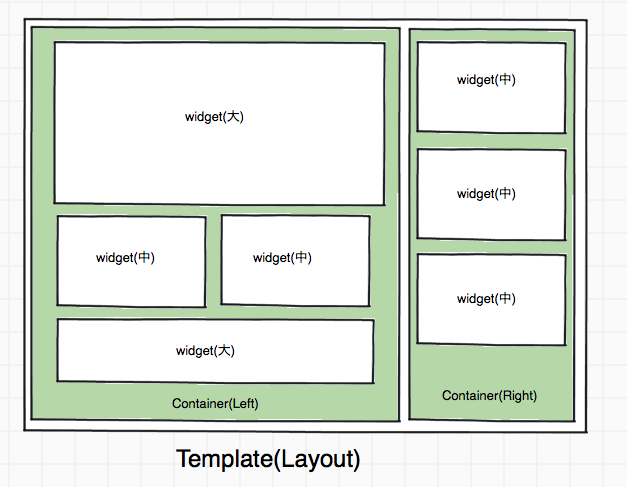

.. _widget:

=========================
ウィジェット
=========================

widgetとは
========================================

サイト管理者がフロントエンドCMS上で操作を行い、
チケットトップページに表示するコンテンツ(e.g. 公開カレンダー、フリーテキスト、画像)などを追加/編集/削除できる機能のこと

ユースケース
========================================

例1. 画像widget
----------------------------------------

#. サイト管理者が、アセットにファイルをアップロードする。
#. イベント詳細ページの編集画面に行き、画像widgetを選ぶ
#. アップロードされた画像から、表示したい画像を選ぶ
#. レイアウトテンプレート内に、widgetをドラッグ&ドロップで配置する
#. イベント詳細ページに選んだ画像が挿入される

widgetの利用方法について
========================================

widgetは以下のような構成になっている

:テンプレート: 一番大きな枠レイアウト構成を決める
:コンテナ: widgetをまとめる枠。各テンプレートによって左側コンテナ。右側などある
:Widget: コンテナの中に埋め込むwidget。サイズは小中大程度を想定

利用するテンプレートの例は以下の通り

このようなテンプレートを３〜５位(少数)作る予定。

利用方法としては

1. 利用するテンプレートを選択する
2. 追加したいwidgetを選ぶ
3. 各コンテナにwidgetを追加していく

実際の使い方
----------------------------------------

1. 利用するテンプレートのレイアウトを選ぶ

   .. image:: ../images/select_layout.png

   少数のレイアウトの候補(3~5個くらい)から、利用するレイアウトを選ぶ

2. 利用したいwidgetを選ぶ。

   .. image:: ../images/select_widget.png

   widgetパレットのようなウィンドウが、設定画面には存在する。

3. widgetを表示したい位置へwidgetパレットからwidgetをD&Dする。

   .. image:: ../images/template_after_DandD.png
   
   widgetを表示したい位置へwidgetパレットからwidgetをD&Dする。
   D&Dしたwidgetをクリックする。ウィザードが起動する。

4. wizardに従って設定を入力する

   .. image:: ../images/widget_wizard.png

   データをwizardに従って入力する。
   (上の図は、カレンダーのwidgetのwizard画面の様子)

5. concrete widgetをドラッグアンドドロップで、テンプレートに追加する。

   .. image:: ../images/template_after_DandD.png

  wizardによる入力が終わると入力内容を持ったwidgetが生成される。
  concrete widgetはconcrete widgetパレットに追加される。

個人用のテンプレートパレットを用意する機能
^^^^^^^^^^^^^^^^^^^^^^^^^^^^^^^^^^^^^^^^^^^^^^^^^^^^^^^^^^^^^^^^^^^^^^^^^^^^^^^^

  実装できたら良い機能として、個人用のテンプレートパレットの機能が挙げられる。

  .. image:: ../images/my_template_palette.png

  これは一度登録した、テンプレートレイアウトやwidgetの配置を保存しておける機能。
  同様のレイアウトのページがほしい場合には、この機能を用いて、過去の配置が読み込めると良い。

.. note::

TBD

.. todo:: ウィジェットサイズを確定する

ウィジェット機能の追加について
========================================

http://dev.ticketstar.jp/redmine-altair/issues/105

ウィジェット追加はコードベースの変更で良い。
(CMS上からウィジェットを追加できる必要はない。)

ただし、モジュール的に追加できるような構成にする。

TBD

各ウィジェットは、1つのコンテナだけで使用できるもの、
複数のコンテナで使用できるものを選択することが出来る。
