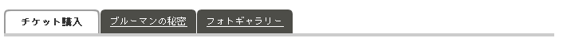

.. _widget-menu:

メニューウィジェット
============================

イベントのメニューを表示するウィジェット。
ウィジェット内に表示されるタブはn個（TBD）とする。

CMS内で管理、生成を行い、テンプレートへの直接記述またはincludeファイルとする。
Ajaxでの呼び出しは行わない想定。

e.g.

.. code-block:: html

 <ul>
   <li class="menu selected">チケット購入</li>
   <li><a href="/himitsu/">ブルーマンの秘密</li>
   <li><a href="/gallery/">フォトギャラリー</li>
 </ul>

データ構造
----------------

see also: :ref:`object-menu`

