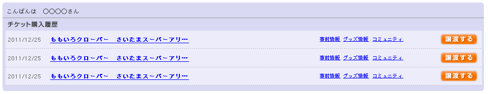

購入履歴ウィジェット
============================

サイト利用者の購入履歴を表示するウィジェット。

サイト利用者の過去の購入履歴をバックエンドに問い合わせ、必要な情報を取得してHTMLを描画する。
取得した情報は一定時間キャッシュする。
バックエンドからクライアントへ購入履歴オブジェクトを渡し、クライアントサイドJavaScriptで描画する方式も検討する。

通常処理のシーケンス:

.. seqdiag::

   seqdiag {
       browser => cms [label = "Request"] {
           cms => cache;
           cms => backend;
           cms => cache;
       }
   }

クライアントサイドJavaScriptで描画するシーケンス:

サイト利用者の認証、識別が必要なため、一度必ずCMSを経由する。
CMSはバックエンドが出力するJSONを直接クライアントへレスポンスする想定。

.. seqdiag::

   seqdiag {
       browser => cms [label = "Request HTML view"];
       browser => cms [label = "Request JSON object"] {
           cms => cache;
           cms => backend;
           cms => cache;
       }
       browser -> browser [label = "Render order history table"];
   }

データ構造
-------------------

see also: :ref:`object-order-history`
