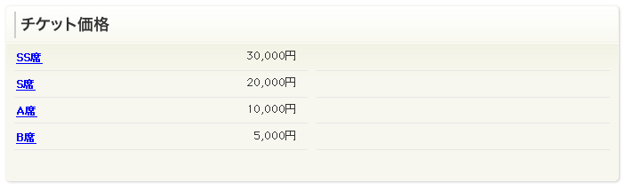

チケットリストウィジェット
============================

チケット（席種、価格）を一覧表示するウィジェット。

価格表の取得について
----------------------------------------

暫定的には以下のようにして取得する

#. EventモデルがTicketを持つ
#. Ticketが価格、席種を持つ

.. note::

   ただし、performance毎に価格が異なるということが考えられるらしい。(dropbox todo)
   返答次第考える。
   https://dev.ticketstar.jp/redmine-altair/issues/185

データ構造
-------------------

see also: :ref:`object-ticket`
